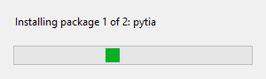
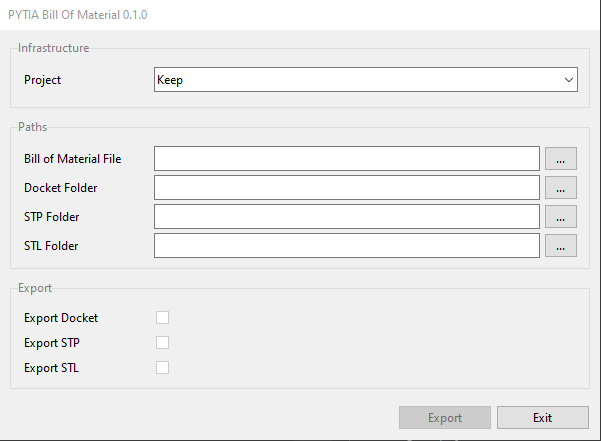
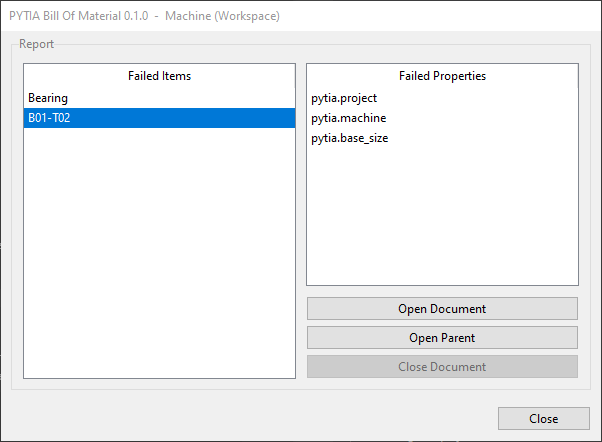

# pytia bill of material

A python app for exporting the bill of material from a CATIA V5 product.


[](https://www.python.org/downloads/)


> ⚠️ The layout of this app is heavily biased towards the workflow and needs of my companies' engineering team. Although almost everything can be changed via config files and presets, the apps basic functionality is built to work in the environment of said company.

Check out the pytia ecosystem:

- **pytia** ([web](https://pytia.deloarts.com/), [repo](https://github.com/deloarts/pytia)): The heart of this project.
- **pytia-property-manager** ([web](https://pytia.deloarts.com/property-manager/v0.html), [repo](https://github.com/deloarts/pytia-property-manager)) : An app to edit part and product properties.
- **pytia-bounding-box** ([web](https://pytia.deloarts.com/bounding-box/v0.html), [repo](https://github.com/deloarts/pytia-bounding-box)): For retrieving the bounding box of a part.
- **pytia-bill-of-material** ([web](https://pytia.deloarts.com/bill-of-material/v0.html), [repo](https://github.com/deloarts/pytia-bill-of-material)): Exports the bill of material and data of a product.
- **pytia-title-block** ([web](https://pytia.deloarts.com/title-block/v0.html), [repo](https://github.com/deloarts/pytia-title-block)): An app to edit a drawing's title block.
- **pytia-quick-export** ([web](https://pytia.deloarts.com/quick-export/v0.html), [repo](https://github.com/deloarts/pytia-quick-export)): Single file export with useful features.
- **pytia-reorder-tree** ([web](https://pytia.deloarts.com/reorder-tree/v0.html), [repo](https://github.com/deloarts/pytia-reorder-tree)): Brings order in your product graph tree.
- **pytia-ui-tools** ([web](https://pytia.deloarts.com/), [repo](https://github.com/deloarts/pytia-ui-tools)): A toolbox for all pytia apps.

Table of contents:

- [pytia bill of material](#pytia-bill-of-material)
  - [1 installation](#1-installation)
  - [2 setup](#2-setup)
    - [2.1 resource files](#21-resource-files)
      - [2.1.1 default files](#211-default-files)
      - [2.1.2 sample files](#212-sample-files)
      - [2.1.3 static files](#213-static-files)
    - [2.2 template files](#22-template-files)
    - [2.3 provide a release folder](#23-provide-a-release-folder)
    - [2.4 build](#24-build)
    - [2.5 release](#25-release)
    - [2.6 docs](#26-docs)
  - [3 usage](#3-usage)
    - [3.1 report](#31-report)
  - [4 workspace](#4-workspace)
  - [5 developing](#5-developing)
    - [5.1 repository](#51-repository)
      - [5.1.1 cloning](#511-cloning)
      - [5.1.2 main branch protection](#512-main-branch-protection)
      - [5.1.3 branch naming convention](#513-branch-naming-convention)
      - [5.1.4 issues](#514-issues)
    - [5.2 poetry](#52-poetry)
      - [5.2.1 setup](#521-setup)
      - [5.2.2 install](#522-install)
      - [5.2.3 tests](#523-tests)
    - [5.3 pre-commit hooks](#53-pre-commit-hooks)
    - [5.4 docs](#54-docs)
    - [5.5 new revision checklist](#55-new-revision-checklist)
  - [6 license](#6-license)
  - [7 changelog](#7-changelog)
  - [8 to dos](#8-to-dos)

## 1 installation

> ✏️ For a guided installation visit [https://pytia.deloarts.com](https://pytia.deloarts.com/installation/v0.html)

On the users machine you need to install the following:

- CATIA
- [Python](https://www.python.org/downloads/)
- [Git](https://gitforwindows.org/)

When the user starts the app it will automatically install all its requirements. Further the app also updates outdated dependencies if needed. The apps environment will be created in the users appdata-folder: `C:\Users\User\AppData\Roaming\pytia\pytia_bill_of_material`

Recommended python install options for the user:

```powershell
python-installer.exe /passive PrependPath=1 Include_doc=0 Include_test=0 SimpleInstall=1 SimpleInstallDescription="python for pytia"
```

For convenience there is a powershell script that will install the required python version for you, see [assets/python_installer.ps1](assets/python_installer.ps1).

## 2 setup

### 2.1 resource files

All configuration is done via json files inside the [resources folder](/pytia_bill_of_material/resources/).

#### 2.1.1 default files

You can leave the default configuration if it suits your needs, but you can always copy any default json file, rename (get rid of 'default') it and edit its content.

Example: If you want to change the content of the [filters.default.json](/pytia_bill_of_material/resources/filters.default.json) you have to copy this file, and paste it as **filters.json**. Then you can edit the content of your newly generated filters-settings file. Same for any other default-resource file.

> ✏️ For a full description of all default files, see [docs/DEFAULT_FILES.md](/docs/DEFAULT_FILES.md).

#### 2.1.2 sample files

Files that are named like **settings.sample.json** must be copied, renamed and edited. Sample files exists only for you to have a guide, of how the config file must look.

Example: Before you can build the app you have to copy the [settings.sample.json](/pytia_bill_of_material/resources/settings.sample.json) and rename it to **settings.json**. Then you can edit its content to match your requirements.

> ✏️ For a full description of all sample files, see [docs/SAMPLE_FILES.md](/docs/SAMPLE_FILES.md).

#### 2.1.3 static files

Files without 'default' or 'sample' in their names cannot be changed! Just leave them there, they are needed for the app to work.

### 2.2 template files

The app uses optional template files, see [templates folder](/pytia_bill_of_material/templates/). To use a template file, copy it and remove the `sample` from the name.

If you want to use the docket-generation-feature you have to add a `docket.CATDrawing` CATIA file in this folder. There is already a sample file in this folder, which is ready-to-use with the [docket.sample.json](/pytia_bill_of_material/resources/docket.sample.json) config file -> rename both files to `docket.CATDrawing` and `docket.json` and the docket generation will work, tweak both files to fit your needs.

### 2.3 provide a release folder

To be able to launch the app from within CATIA you need to provide a release folder, where the app and a launcher file are stored. Both files (the app and the launcher) will be created with the [_build.py](_build.py) script, and released to the release-folder with the [_release.py](_release.py) script.

> ❗️ Add this release folder to the **settings.json** file as value of the **paths.release** key.

### 2.4 build

> ❗️ Do not build the app with poetry! This package is not not meant to be used as an import, it should be used as an app.

To build the app and make it executable for the user run the [_build.py](_build.py) python file. The app is only built if all tests are passing. The app will be exported to the [_build-folder](/build/). Additionally to the built python-file a catvbs-file will be exported to the same build-folder. This file is required to launch the app from within CATIA, see the next chapter.

> ✏️ You can always change the name of the build by editing the value from the **files.app** key of the **settings.json**.
>
> ✏️ The reason this app isn't compiled to an exe is performance. It takes way too long to load the UI if the app isn't launched as python zipfile.

### 2.5 release

To release the app into the provided release folder run the [_release.py](_release.py) script.

To run the app from within CATIA, add the release-folder to the macro-library in CATIA. CATIA will recognize the catvbs-file, so you can add it to a toolbar.

You can always change the path of the release folder by editing the value from the **paths.release** key of the **settings.json**.

> ⚠️ Once you built and released the app you cannot move the python app nor the catvbs script to another location, because absolute paths will be written to those files. If you have to move the location of the files you have to change the paths in the **settings.json** config file, build the app again and release it to the new destination.

### 2.6 docs

You can find the documentation in the [docs folder](/docs).

## 3 usage

Use the launcher (a.k.a the catvbs-file) to launch the app. On the first run all required dependencies will be installed:



After the installation the app starts automatically:



The app retrieves all information from the documents properties, except the material value, which is fetched from the applied material.

The usage itself is pretty straight forward, as long as all config files are setup properly.

Object | Description
--- | ---
Project | The user can overwrite the project number for all items of the bill of material. If set to `Keep` no project number will be overwritten.
Bill of Material File | The full path to the bill of material xlsx file. The folder must exist, otherwise the `Export` button will be disabled.
Docket Folder | The folder into which all generated docket files will be stored. The folder must exist, otherwise the `Export Docket` checkbox will be disabled.
Drawing Folder | The folder into which all drawing files (pdf and dxf) will be stored. The folder must exist, otherwise the `Export Drawings` checkbox will be disabled.
STP Folder | The folder into which all generated step files will be stored. The folder must exist, otherwise the `Export STP` checkbox will be disabled.
STL Folder | The folder into which all generated stl files will be stored. The folder must exist, otherwise the `Export STL` checkbox will be disabled.
JPG Folder | The folder into which all generated jpg files will be stored. The folder must exist, otherwise the `Export JPG` checkbox will be disabled.
Ignore Unknown | Ignores all product tree nodes with the source `unknown`.
Ignore Prefixed | Ignores all product tree nodes which start with the given prefixes. Prefixes can be separated by a semicolon.

### 3.1 report

If the export fails because any criteria from the `filters.json` aren't satisfied, the report window will be opened. This allows the user to see which item from the bill of material fails:



## 4 workspace

The workspace is an **optional** config file, that can be used to alter the behavior of the app. The workspace file is a yaml-file, which must be saved somewhere in the project directory, where the catia document, from which to manage the properties, is also stored:

```bash
your-fancy-project
├─── main.CATProduct
├─── subfolder-A
│    ├─── product-A.CATProduct
│    ├─── part-A-01.CATPart
│    └─── part-A-02.CATPart
├─── subfolder-B
│    ├─── product-B.CATProduct
│    ├─── part-B-01.CATPart
│    └─── part-B-02.CATPart
└─── workspace.yml
```

As long as the workspace file is located somewhere in the project, and as long as this file is in the **same** folder, or any folder **above** the CATProduct file, it will be used.

For a detailed description of the workspace config file, see [WORKSPACE_FILE](docs/WORKSPACE_FILE.md).

The filename of the workspace file can be changed in the **settings.json** file, see [SAMPLE_FILES](docs/SAMPLE_FILES.md).

## 5 developing

For developing you would, additionally to the system requirements, need to install:

- [Poetry](https://python-poetry.org/docs/master/#installation)
- [Git](https://git-scm.com/downloads) or [GitHub Desktop](https://desktop.github.com/)

### 5.1 repository

#### 5.1.1 cloning

Clone the repo to your local machine:

```powershell
cd $HOME
New-Item -Path '.\git\pytia-bill-of-material' -ItemType Directory
cd .\git\pytia-bill-of-material\
git clone git@github.com:deloarts/pytia-bill-of-material.git
```

Or use GitHub Desktop.

#### 5.1.2 main branch protection

> ❗️ Never develop new features and fixes in the main branch!

The main branch is protected: it's not allowed to make changes directly to it. Create a new branch in order work on issues. The new branch should follow the naming convention from below.

#### 5.1.3 branch naming convention

1. Use grouping tokens at the beginning of your branch names, such as:
    - feature: A new feature that will be added to the project
    - fix: For bugfixes
    - tests: Adding or updating tests
    - docs: For updating the docs
    - wip: Work in progress, won't be finished soon
    - junk: Just for experimenting
2. Use slashes `/` as delimiter in branch names (`feature/docket-export`)
3. Avoid long descriptive names, rather refer to an issue
4. Do not use bare numbers as leading parts (`fix/108` is bad, `fix/issue108` is good)

#### 5.1.4 issues

Use the issue templates for creating an issue. Please don't open a new issue if you haven't met the requirements and add as much information as possible. Further:

- Format your code in an issue correctly with three backticks, see the [markdown guide](https://docs.github.com/en/get-started/writing-on-github/getting-started-with-writing-and-formatting-on-github/basic-writing-and-formatting-syntax).
- Add the full error trace.
- Do not add screenshots for code or traces.

### 5.2 poetry

#### 5.2.1 setup

If you prefer the environment inside the projects root, use:

```powershell
poetry config virtualenvs.in-project true
```

> ⚠️ Make sure not to commit the virtual environment to GitHub. See [.gitignore](.gitignore) to find out which folders are ignored.

#### 5.2.2 install

Install all dependencies (assuming you are inside the projects root folder):

```powershell
poetry install
```

Check your active environment with:

```powershell
poetry env list
poetry env info
```

Update packages with:

```powershell
poetry update
```

#### 5.2.3 tests

Tests are done with pytest. For testing with poetry run:

```powershell
poetry run pytest
```

> ⚠️ Test discovery in VS Code only works when CATIA is running.

### 5.3 pre-commit hooks

Don't forget to install the pre-commit hooks:

```powershell
pre-commit install
```

### 5.4 docs

Documentation is done with [pdoc3](https://pdoc3.github.io/pdoc/).

To update the documentation run:

```powershell
python -m pdoc --html --output-dir docs pytia_bill_of_material
```

For preview run:

```powershell
python -m pdoc --http : pytia_bill_of_material
```

### 5.5 new revision checklist

On a new revision, do the following:

1. Update **dependency versions** in
   - [pyproject.toml](pyproject.toml)
   - [dependencies.json](pytia_bill_of_material/resources/dependencies.json)
   - [README.md](README.md)
2. Update **dependencies**: `poetry update`
3. Update the **version** in
   - [pyproject.toml](pyproject.toml)
   - [__ init __.py](pytia_bill_of_material/__init__.py)
   - [README.md](README.md)
4. Run all **tests**: `poetry run pytest`
5. Check **pylint** output: `poetry run pylint pytia_bill_of_material/`
6. Update the **documentation**: `poetry run pdoc --force --html --output-dir docs pytia_bill_of_material`
7. Update the **lockfile**: `poetry lock`
8. Update the **requirements.txt**: `poetry export --with dev -f requirements.txt -o requirements.txt`

## 6 license

[MIT License](LICENSE)

## 7 changelog

[**v0.9.2**](https://github.com/deloarts/pytia-bill-of-material/releases/tag/v0.9.2): Add fallback solution for export error.  
[**v0.9.1**](https://github.com/deloarts/pytia-bill-of-material/releases/tag/v0.9.1): Fix drawing export.  
[**v0.9.0**](https://github.com/deloarts/pytia-bill-of-material/releases/tag/v0.9.0): Add themes.  
[**v0.8.0**](https://github.com/deloarts/pytia-bill-of-material/releases/tag/v0.8.0): Add ignore-options.  
[**v0.7.1**](https://github.com/deloarts/pytia-bill-of-material/releases/tag/v0.7.1): Add group to default setting. Resolve paths.  
[**v0.7.0**](https://github.com/deloarts/pytia-bill-of-material/releases/tag/v0.7.0): Add image export feature.  
[**v0.6.4**](https://github.com/deloarts/pytia-bill-of-material/releases/tag/v0.6.4): Fix launcher path.  
[**v0.6.3**](https://github.com/deloarts/pytia-bill-of-material/releases/tag/v0.6.3): Expand environment variables in settings paths.  
[**v0.6.2**](https://github.com/deloarts/pytia-bill-of-material/releases/tag/v0.6.2): Fix hidden user prompt.  
[**v0.6.1**](https://github.com/deloarts/pytia-bill-of-material/releases/tag/v0.6.1): Fix excel header naming.  
[**v0.6.0**](https://github.com/deloarts/pytia-bill-of-material/releases/tag/v0.6.0): Custom excel header names.  
[**v0.5.0**](https://github.com/deloarts/pytia-bill-of-material/releases/tag/v0.5.0): Remove local dependencies.  
[**v0.4.0**](https://github.com/deloarts/pytia-bill-of-material/releases/tag/v0.4.0): Add made and bought option to excel export.  
[**v0.3.2**](https://github.com/deloarts/pytia-bill-of-material/releases/tag/v0.3.2): Performance improvement and minor fixes.  
[**v0.3.1**](https://github.com/deloarts/pytia-bill-of-material/releases/tag/v0.3.1): Fix drawing path bug.  
[**v0.3.0**](https://github.com/deloarts/pytia-bill-of-material/releases/tag/v0.3.0): Add drawing export feature.  
[**v0.2.0**](https://github.com/deloarts/pytia-bill-of-material/releases/tag/v0.2.0): Add report document handler and log console.  
[**v0.1.2**](https://github.com/deloarts/pytia-bill-of-material/releases/tag/v0.1.2): Fix deleting template files too early.  
[**v0.1.1**](https://github.com/deloarts/pytia-bill-of-material/releases/tag/v0.1.1): Add failed property description.  
[**v0.1.0**](https://github.com/deloarts/pytia-bill-of-material/releases/tag/v0.1.0): Initial commit.  

## 8 to dos

Using VS Code [Comment Anchors](https://marketplace.visualstudio.com/items?itemName=ExodiusStudios.comment-anchors) to keep track of to-dos.
